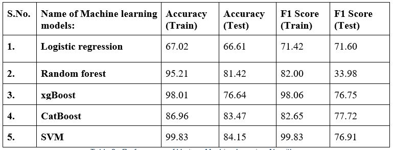
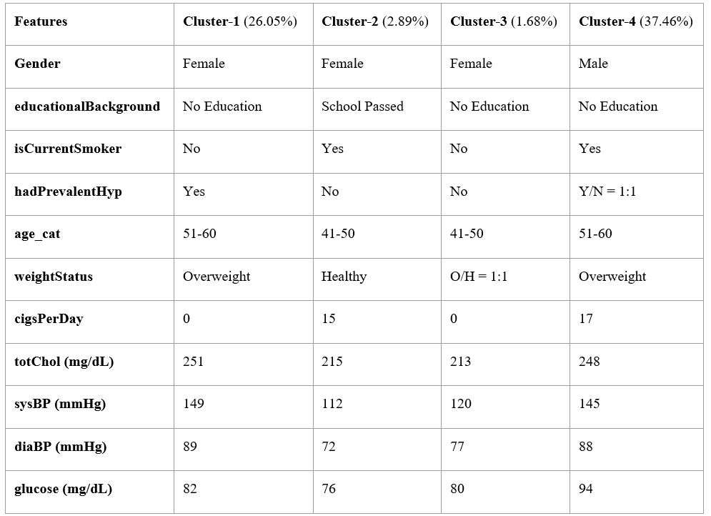
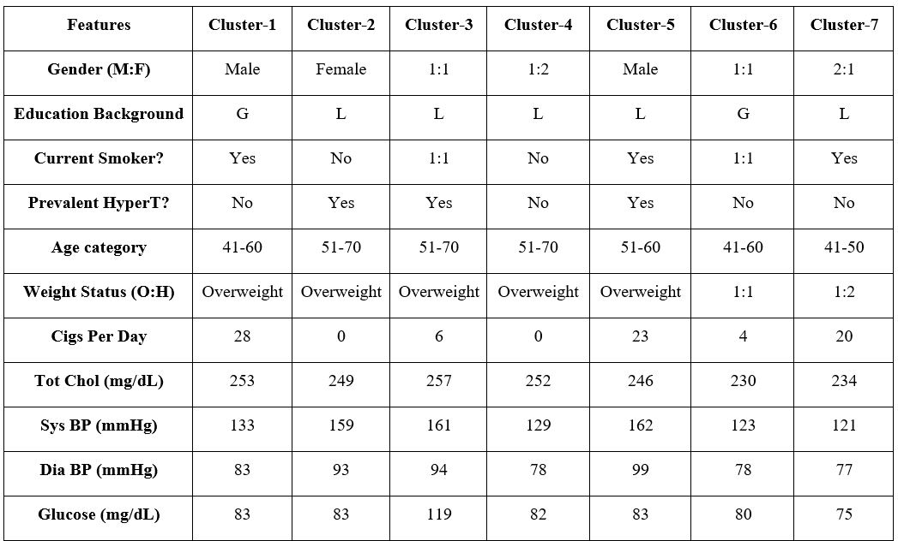
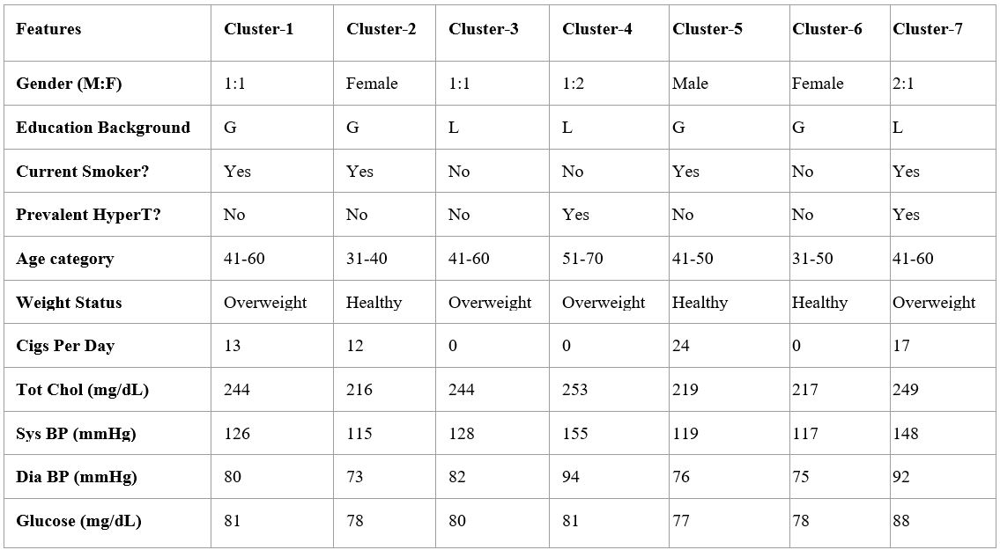

# Integrated HealthCare Management
This project seeks to delve into multiple objectives pertaining to the ever-increasing role of artificial intelligence in the field of healthcare, addressing potential stakeholders involved in the upgradation of medical health facilities provided to the masses and eventually upping the ante with even more inclusive public healthcare policies.
## Dataset and Methods
The dataset is publicly available on the Kaggle website, and it is from an ongoing cardiovascular study on residents of the town of Framingham, Massachusetts. The classification goal is to predict whether the patient has 10-year risk of future coronary heart disease (CHD).The dataset provides the patients’ information. It includes around 4,000 records and 15 attributes (variables) such as gender, age, education, current smoker, cigarettes per day, BP medicine, prevalent stroke, prevalent hypertension, diabetes, cholesterol level, systolic BP, diastolic BP, BMI, heart rate and glucose level.
## Data Pre-processing
There are 582 rows which have missing values in one or more variables. These are removed from the data table with the help of a command “df.dropna” of pandas library.
“BMI” feature in the given dataset is converted into another feature named “weightStatus” with conditions as: BMI below 18.5: assign Underweight, BMI between 18.5 and 25: assign Healthy and BMI above 25: assign Overweight. “Age” feature is converted into another feature named “age_cat” with ranges of age taken as: 31-40, 41-50, 51-60, 61-70.
“Chi-square test” is used to generate P-values for each variable. P-value threshold is tweaked as 30% to obtain final features.
The categorical variables in the dataset are encoded with numerical values with the help of “LabelEncoder” class of “sklearn” library in python.

## Classification Results

## Clustering Results

### Clustering on Whole dataset:

### Clustering on CHD patients dataset:

### Clustering on non-CHD patients dataset:

## Conclusion
Firstly, an exploratory data analysis has been carried out on the dataset comprising of 15 attributes pertaining to the residents of Framingham, Massachusetts as a part of an ongoing cardiovascular health survey. This analysis yielded the most crucial ones of those attributes that were further taken into account while carrying out the Machine Learning based Classification Models. Hence, a fraud detection feature has been implemented.

Next, K-Means Clustering was carried out on the same dataset in order to identify the commonalities of all the people who may or may not be suffering from the disease based on the aforementioned attributes. All such possible clustering models were then qualitatively scrutinised in order to develop and understand use cases, and further escalating into standardization of treatment.

Thirdly, as part of the extended dataset, a quantitative analysis was carried out to determine resource utilization and cost of treatment for the population clusters.

Finally, a qualitative analysis on high need, high cost patients reflected upon both the medical and anthropological factors that classify concerned patients into this category.
